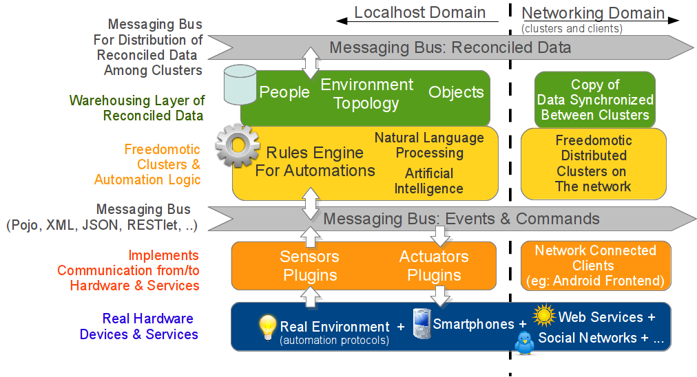
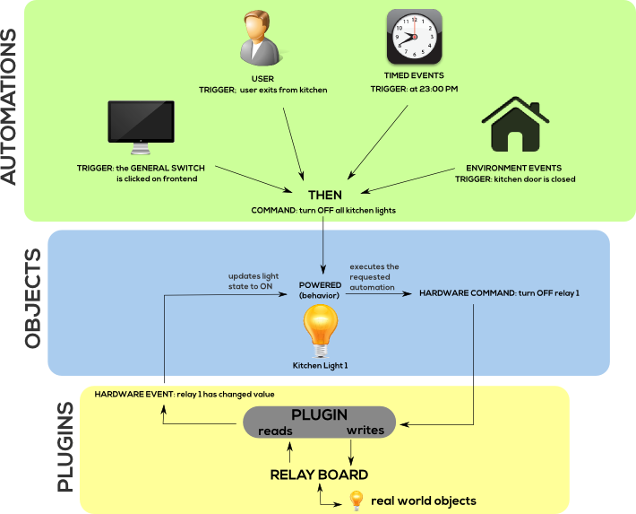
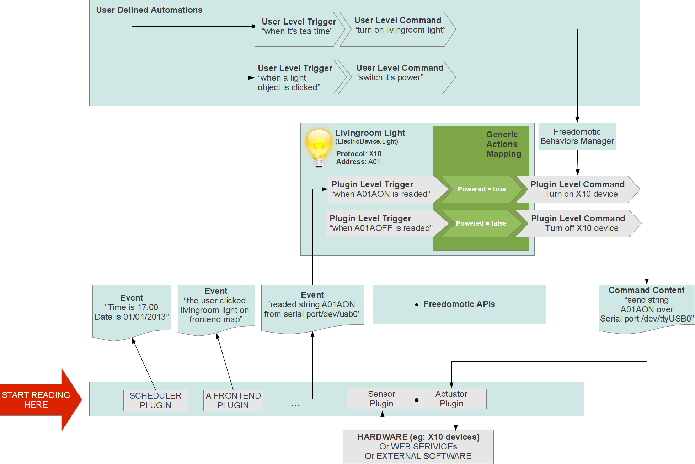

Architecture components
=======================

Freedomotic is composed by a core (the framework) plus some plugins.

Framework
#########

The core part is a **framework** that:

1. **implements** a language independent messaging system based on **Enterprise Integration Pattern**. So you can develop in
your favorite language and just exchange messages with the other software components. The aim of the messaging system is to link all
software modules together in a flexible and abstract way, relating them using the concept of channels (publish-subscribe to different levels of a
topics hierarchy)

2. **maintains** an internal data structure representing the environment (topology, rooms connections as a graph, ...), the things in zones and
their state (on, off, open, closed, 50% dimmed, ...)

3. **creates** an abstraction layer so users and external software modules can use a high level logic like "**turn on kitchen light**" instead of "**send to
COM1 port the string #*A01AON##**". This way a developer can leverage other plugins features at a high logical level because the
modules can see the same environment map as the user. All data component (environment, objects, triggers, commands) can be defined
in XML and easily exchanged on the network between different nodes of the P2P Freedomotic network

4. **provides** a rules engine coupled with a natural language processing system to let the user write automations in plain English like "**if outside
is dark turn on living-room light**". You can add, update and delete this automations at runtime using any human computer interface like GUIs,
or even speak them.

    
    Freedomotic architecture

Plugins
#######
Freedomotic plugins can add more features to the framework and can be developed and distributed as completely independent packages on our marketplace.

Device plugins
**************
They usually are developed to communicate with automation hardware like X10, KNX and so on, but also graphical frontends and "web service readers" are Freedomotic plugins just as any other source of info, like webcams, text to speech engines and SMS senders.

Object plugins
**************
You can also develop object plugins which are pieces of software which models the behavior of objects like lamps, doors, etc... instructing the framework on how they behave.

For example a lamp object plugin tells the framework that a lamp has a boolean behavior called **powered** and a **dimmer** behavior which is represented by an integer
from 0 to 100. A lamp can **turn on**, **turn off** and **dimm**. If dimmed becomes 0% the lamp is powered=false and if dimmed > 0% the lamp is powered=true.

 
    Plugins, things and automations
    

Plugins, Objects and Automations interaction
############################################

The final goal is to define an automation which can **turn on** the livingroom light when it's tea time (17 o'Clock).

#. The scheduler plugin notifies to Freedomotic the current time (17:00 PM).

#. A trigger named "**it's tea time**" is configured to listen to all time based events. It carries a rule inside which is ``event.time.hour == 17 AND event.time.minute == 0``.

#. When the event is received by this trigger, the rule is evaluated. If the evaluation success then the trigger fires, indicating that now it's actually the time to take the tea.

#. At this point all the corresponding automation "**IF (trigger: it's tea time) THEN (command: turn on livingroom light)**" is loaded by the system and the command is executed forwarding the generic request "**turn on livingroom light**" to the plugin which can transform it to a protocol dependent command (eg: send string 'A01AON' on serial port /dev/ttyUSB0).

    
    
    